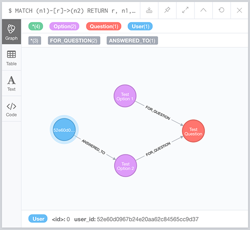

django-neomodel sample
===========================

This is a simple application of using dockerized **neo4j** database on **Python Django** with **django-neomodel** plugin

There are three models at `/src/App/models` folder that define the model of nodes and relations for  User, Question, and Option.

The usage of the models are in `src/App/views.py` by adding dump data in the db.

### Usage

This assumes you have docker installed.

    $ docker-compose up --build

The application will be available at http://0.0.0.0:8000 (It should adds dump data to the neo4j db and show them on the page).

Neo4j browser will be available at http://localhost:7474/